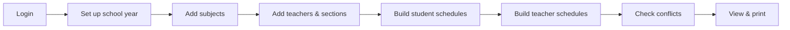

# SmartSched — System Guide (Simple Explanation)

**Passi City College · Class Scheduling System**

*Written so anyone can understand — like explaining to a curious 5-year-old who loves school.*

---

## Table of Contents

1. [What Is SmartSched?](#1-what-is-smartsched)
2. [The Big Picture (Like a Story)](#2-the-big-picture-like-a-story)
3. [Who Uses SmartSched?](#3-who-uses-smartsched)
4. [How the System Flows (Step by Step)](#4-how-the-system-flows-step-by-step)
5. [The Two Kinds of Schedules](#5-the-two-kinds-of-schedules)
6. [Logic SmartSched Uses (The Rules)](#6-logic-smartsched-uses-the-rules)
7. [Algorithms (How the Computer Thinks)](#7-algorithms-how-the-computer-thinks)
8. [Features and What Each Page Does](#8-features-and-what-each-page-does)
9. [Rooms, Time, and Breaks](#9-rooms-time-and-breaks)
10. [Safety, Limits, and Login](#10-safety-limits-and-login)
11. [Technical Parts (For Grown-Ups)](#11-technical-parts-for-grown-ups)

---

## 1. What Is SmartSched?

Imagine your school is a big building with many classrooms, many teachers, and many classes (sections). Every week, someone has to answer questions like:

- *When does Teacher Ana teach Math?*
- *Which room is Section 1A in on Tuesday?*
- *Is Room 3 booked twice at the same time?*

**SmartSched** is a computer program (a **web app**) that helps **Passi City College (PCC)** answer those questions without using messy paper grids.

Think of it like a **magic school timetable notebook** that:

- Remembers every teacher’s weekly plan
- Remembers every student section’s weekly plan
- **Warns you** if two classes try to use the same room at the same time
- **Warns you** if one teacher is supposed to be in two places at once
- Can **print** neat Excel schedules for teachers and students
- Keeps each **department** (BSIT, CRIM, BSBA, etc.) in its own safe box of data

**In one sentence:** SmartSched is a scheduling helper for college departments so classes, rooms, and teachers fit together without clashes.

---

## 2. The Big Picture (Like a Story)

Here is the story of how SmartSched works, from start to finish:



1. **A grown-up logs in** (PIN + password, like a secret door).
2. They tell SmartSched **which school year and semester** it is.
3. They add **subjects** (Math, Programming, etc.).
4. They add **teachers** and **class sections** (like “BSIT 1A”).
5. They fill in **when each section has class** (student schedule).
6. They fill in **when each teacher teaches** (instructor schedule) — sometimes copied automatically from the student schedule.
7. SmartSched **checks for mistakes** (double-booked rooms, busy teachers).
8. They **look at the finished timetable** and **download Excel files** to share or print.

The **frontend** (what you see in the browser) talks to the **backend** (the server brain), which saves everything in a **PostgreSQL database** (a big organized filing cabinet).

---

## 3. Who Uses SmartSched?

| Role | Who they are | What they can do |
|------|----------------|------------------|
| **Department admin** | Staff for one program (e.g. BSIT only) | Manage their department’s subjects, teachers, sections, and schedules |
| **Super admin** | College-wide IT or registrar lead | See **all** departments, fix conflicts across departments, manage admin accounts, backup the database |

Each department has its **own color theme** and logo in the app (BSIT, CRIM, BSBA, BSHM, BSED, BEED).

Departments supported in code: **BSIT, CRIM, BSBA, BSHM, BSED, BEED**.

---

## 4. How the System Flows (Step by Step)

### Step 0 — Open the app and log in

- You open the website (React + Vite frontend, usually `localhost:5173`).
- You enter **email → PIN → password**.
- The server checks your secret codes using **bcrypt** (scrambled passwords — like a locked diary).
- If you fail too many times, the account **locks for 15 minutes** (server) or a short lockout on the login screen (frontend).

### Step 1 — Academic Setup

- Pick **academic year** (e.g. 2025–2026) and **semester** (1st or 2nd).
- This is like writing the date on top of your notebook so every schedule belongs to the right term.

### Step 2 — Subject Setup

- Add subjects with codes, names, and types (Major, GE, etc.).
- Subjects can be tied to year level and semester rules (e.g. General Education for certain years).

### Step 3 — Instructor Pool

- Register teachers: name, employment type (Regular, Part-time, etc.).
- The system stores them in the department’s database schema.

### Step 4 — Instructor Assignment

- Link teachers to the subjects they are allowed to teach.
- This is like giving each teacher a list of “classes I can handle.”

### Step 5 — Section Pool

- Create student sections (e.g. “BSIT 1A”) with year level (1st–4th year).

### Step 6 — Student Load

- Choose a section.
- Fill a **weekly grid** (Monday–Sunday, 7:00 AM–8:00 PM style hours).
- For each time slot: subject, room, instructor.
- Click **Save** → data goes to `student_schedules` in the database.
- Optional: **Auto-Generate Faculty** — copy student blocks into teacher schedules (see Algorithms).

### Step 7 — Instructor Load

- Choose a teacher.
- Fill the same kind of weekly grid for **that teacher’s** classes.
- Save to `schedules` table (linked to `instructors`).

### Step 8 — Schedule Output & Room Schedule

- View saved timetables, edit blocks, clear all, print preview.
- **Room Schedule** shows which room is busy when (bird’s-eye view of rooms).

### Step 9 — Export (Excel)

- Click generate → Python script builds a formatted `.xlsx` file.
- Download **Faculty** or **Student** schedule workbook.

---

## 5. The Two Kinds of Schedules

SmartSched keeps two parallel timetables. They should **match** in real life, but the app stores them separately:

| Type | Stored in | Keyed by | Purpose |
|------|-----------|----------|---------|
| **Student schedule** | `student_schedules` | **Section** (e.g. BSIT 1A) | “What does this class group do each week?” |
| **Instructor schedule** | `schedules` | **Instructor** (teacher name) | “What does this teacher do each week?” |

Each schedule is made of **blocks**:

- **Day** — Monday, Tuesday, …
- **Start / end time** — numbers like 7, 8, 12.5 (half hours supported)
- **Subject**, **section**, **room**, **room type** (Lecture or Laboratory)
- **Break blocks** — not real classes; lunch and rest breaks inserted automatically

---

## 6. Logic SmartSched Uses (The Rules)

These are the “house rules” the app follows.

### 6.1 Grid → blocks (merging cells)

When you paint subjects on the hourly grid, the app **merges** touching hours into one block if they have the same subject, room, and section (or same instructor for student grid).

*Kid version:* If Math is three hours in a row in the same room, it becomes **one long Math block**, not three tiny ones.

### 6.2 Lunch break (12:00–1:00 PM)

- Lunch is **12:00 to 1:00 PM** (`LUNCH_START = 12`, `LUNCH_END = 13`).
- If a class crosses lunch, it is **split**: class before lunch → **LUNCH BREAK** → class after lunch.

### 6.3 Teaching breaks (every 3 hours)

- After **3 hours** of teaching in a row (`BREAK_TRIGGER = 3`), the app inserts a **1-hour break** (`BREAK_DUR = 1`).
- Long classes may be **split** so breaks fit in the middle.

*Kid version:* Teachers need a rest snack break after teaching a while, just like kids need recess.

### 6.4 Room types

- **Lecture rooms:** Room 1–5  
- **Lab rooms:** Lab A, Lab B, Lab C  
- Labs are marked as **Laboratory**; others are **Lecture**.

### 6.5 Conflict rules (before save)

When you save, SmartSched compares **new blocks + all existing blocks** and says **no** if:

| Conflict type | Meaning (simple) |
|---------------|------------------|
| **Room conflict** | Same room, same day, overlapping times — two different classes fighting for one room |
| **Instructor conflict** | Same teacher, same day, overlapping times — teacher in two places at once |
| **Section conflict** | Same section has two different teachers at the same time |
| **Section room conflict** | Same section in two different rooms at the same time |

**Overlap test (the math):** Two blocks overlap if:

`start_A < end_B` **and** `start_B < end_A`

*Kid version:* If one class ends at 10 and another starts at 9, they bump into each other on the clock.

**Special case:** Same room + same section + same instructor at the same time might be allowed as one logical class (not counted as a room fight).

### 6.6 Suggestions when something clashes

If there is a conflict, the app can suggest:

- A **different empty room** same day and time
- A **different time** same room and day
- A **different day** same room and time

It only suggests up to **5** ideas — like a helpful friend saying “try Lab B instead!”

### 6.7 Capacity limits (how full the filing cabinet can get)

Per department, roughly:

| Limit | Max |
|-------|-----|
| Instructors | 200 |
| Subjects per instructor | 30 |
| Sections | 100 |
| Instructor schedule blocks | 5,000 |
| Student schedule blocks | 5,000 |
| Academic years | 20 |

If you hit a limit, save fails with a clear error message.

---

## 7. Algorithms (How the Computer Thinks)

“Algorithm” just means **a recipe the computer follows**. SmartSched uses several recipes:

### 7.1 Pairwise conflict detection — O(n²)

**Where:** `detectConflicts()` in the frontend (`App.jsx`).

**Recipe:**

1. Take every pair of schedule blocks (block A, block B).
2. Skip if either is a break.
3. Skip if different days.
4. Check time overlap.
5. If overlap, check room / instructor / section rules and record a conflict.

*Kid version:* Compare every class sticker with every other sticker and see if they fight.

**Super admin** uses a similar idea but groups by **room+day** and **instructor+day** first (faster for huge lists) and marks **cross-department** clashes as more serious.

### 7.2 Break insertion — greedy split

**Where:** `insertBreaks()` in `App.jsx`.

**Recipe:**

1. Sort blocks by start time.
2. Insert lunch where needed.
3. Walk through teaching blocks; count teaching hours; when count hits 3, insert a break and reset.

This is **greedy** — it fixes breaks as it goes left-to-right through the day.

### 7.3 Auto-generate faculty from students — copy with deduplication

**Where:** `POST /api/generate-faculty-from-students` in `BackEnd/server.js`.

**Recipe:**

1. Read all **student** blocks that have an instructor name.
2. For each block:
   - Make sure the instructor exists in `instructors` table.
   - Check if an **identical** instructor schedule already exists (same teacher, subject, section, day, start, end).
   - If not duplicate → **insert** into `schedules`.
   - If duplicate → **skip**.
3. Return how many were added vs skipped.

*Kid version:* Copy the student timetable onto the teacher’s wall chart, but don’t paste the same sticker twice.

**Note:** This does **not** invent new times — it **mirrors** what was already planned for students.

### 7.4 Conflict suggestions — brute-force search

**Where:** `findSuggestions()` in `App.jsx`.

**Recipe:**

- Try every other room on that day.
- Try every other hour slot (respecting lunch).
- Try every other day.
- Keep slots that have **zero** overlapping blocks.

Simple but easy to understand.

### 7.5 Subject icon hash

**Where:** `getSubjectIcon()` in `App.jsx`.

- Adds a fun emoji per subject name using a small **string hash** (consistent icon for same subject).

### 7.6 Excel export layout

**Where:** `BackEnd/generate.py` and `generate_student.py`.

**Recipe:**

1. Load schedules from database.
2. Build an Excel workbook with **openpyxl**.
3. One sheet per instructor (faculty) or per section (student).
4. Rows = time slots, columns = days; merge cells for multi-hour blocks.
5. Color-code labs vs lectures; strip emoji for compatibility with OnlyOffice.

Not a scheduling solver — a **pretty printer** for data you already saved.

### What SmartSched does NOT do

- It does **not** use AI or genetic algorithms to **automatically find** the perfect timetable from scratch.
- It does **not** optimize travel time or teacher preferences beyond conflict checks and suggestions.
- Humans still **place** classes on the grid; the computer **checks**, **organizes breaks**, **copies**, and **reports**.

---

## 8. Features and What Each Page Does

### Main menu (department admin)

| Page | What you do here |
|------|------------------|
| **Dashboard** | Quick stats and welcome; see semester context |
| **Academic Setup** | School year + semester |
| **Subject Setup** | CRUD subjects (codes, GE rules, etc.) |
| **Instructor Pool** | Add/edit/delete teachers |
| **Instructor Assignment** | Which teacher teaches which subject |
| **Section Pool** | Add class sections by year level |
| **Student Load** | Weekly grid per **section** + Auto-Generate Faculty button |
| **Instructor Load** | Weekly grid per **teacher** |
| **Schedule Output** | View/edit/print instructor & student timetables; clear all; export |
| **Room Schedule** | See room usage across the week |

### Super admin panel (extra powers)

| Feature | What it does |
|---------|----------------|
| **Overview** | Count instructors, sections, schedule blocks per department |
| **Department preview** | “Pretend” to be a department and edit as them |
| **Admin accounts** | Create department admins, unlock locked accounts |
| **Database viewer** | Browse raw schedule tables |
| **Conflict detector** | Scan **all departments** for room and instructor double-bookings |
| **Analytics** | Charts/stats from schedule data |
| **Backup** | Download PostgreSQL dump (`pg_dump`) |

### Other features

- **Print modal** — printable layout with subject codes and breaks  
- **Edit schedule block** — change time/room after save  
- **Conflict toast** — pop-up explaining what went wrong  
- **Department themes** — colors and logos per program  
- **Instructor registration** (separate module) — extended teacher/subject registration API  

---

## 9. Rooms, Time, and Breaks

### Time grid

- Days: **Monday through Sunday**
- Hours: roughly **7 AM to 8 PM** (`DAY_START = 7`, `DAY_END = 20`)
- Half-hour steps are supported in display (`fmtH` handles `.5` as 30 minutes)

### Rooms

| Lecture | Laboratory |
|---------|------------|
| Room 1–5 | Lab A, B, C |

### Breaks on the timetable

- **Lunch** — fixed noon block  
- **Teaching break** — after 3 hours of class  
- Breaks show as ☕ **Break** in Schedule Output (yellow styling)

Break rows are stored with `is_break = true` so conflict checks **ignore** them.

---

## 10. Safety, Limits, and Login

### Login flow

1. **PIN verification** (`/auth/verify-pin`) — first key  
2. **Password login** (`/auth/login`) — second key  
3. Session cookie (8 hours) — browser remembers you’re inside  

### Security ideas

- Passwords and PINs stored as **bcrypt hashes** (not plain text)  
- Failed attempt counters → **lockout**  
- **CORS** only allows the frontend origin  
- Each department’s data lives in a **separate PostgreSQL schema** (`bsit`, `crim`, …)  

### Data isolation

- Department admin only sees **their** schema.  
- Super admin can see **everyone** or preview one department at a time.

---

## 11. Technical Parts (For Grown-Ups)

### Architecture

```
Browser (React + Vite)
    ↕ HTTP + cookies (session)
Express.js server (BackEnd/server.js)
    ↕ SQL
PostgreSQL (database per department schema)
    ↕ optional
Python scripts (openpyxl) for Excel export
```

### Main technologies

| Layer | Tech |
|-------|------|
| Frontend | React, Vite, JSX |
| Backend | Node.js, Express, express-session |
| Database | PostgreSQL (`pg` driver) |
| Auth | bcrypt, server-side sessions |
| Export | Python 3, openpyxl |

### Important API examples

- `GET/POST /api/schedules` — instructor timetables  
- `GET/POST /api/student-schedules` — section timetables  
- `POST /api/generate-faculty-from-students` — mirror student → faculty  
- `POST /api/generate` — run Python Excel builder  
- `GET /api/download?type=instructor|student` — download `.xlsx`  

### File locations (for developers)

| File | Role |
|------|------|
| `frontend/src/App.jsx` | Main UI, grids, conflicts, breaks |
| `BackEnd/server.js` | All API routes and auth |
| `BackEnd/database.js` | PostgreSQL pool + capacity constants |
| `BackEnd/generate.py` | Faculty Excel export |
| `BackEnd/generate_student.py` | Student Excel export |
| `frontend/src/SuperAdminPanel.jsx` | Super admin tools |
| `frontend/src/ProtectedRoute.jsx` | Login screens |

---

## Quick Summary (Read This to a 5-Year-Old)

> **SmartSched is a computer helper for college.**  
> You tell it which subjects, teachers, and classes you have.  
> You paint when each class happens on a weekly calendar.  
> It makes sure **no room is double-booked** and **no teacher is in two places at once**.  
> It adds **lunch and rest breaks** automatically.  
> It can **copy** student schedules onto teacher schedules.  
> It can **print** pretty Excel timetables.  
> Each department has its own notebook; the super boss can peek at all notebooks and find mistakes across the whole school.

---

*Document generated from the SmartSched codebase. Last updated: May 2026.*
